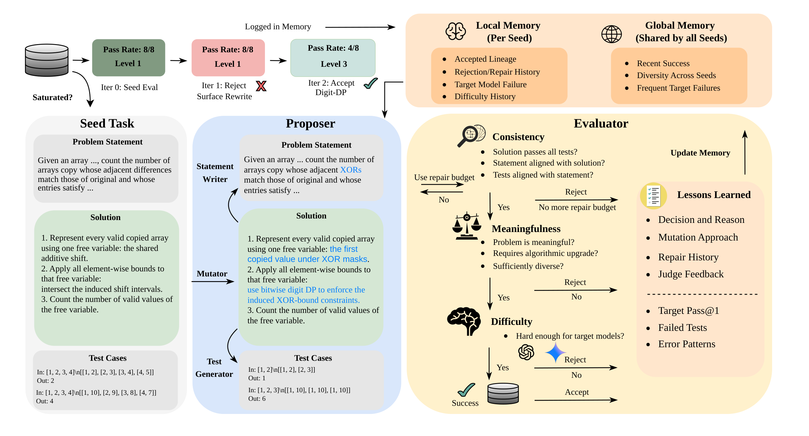
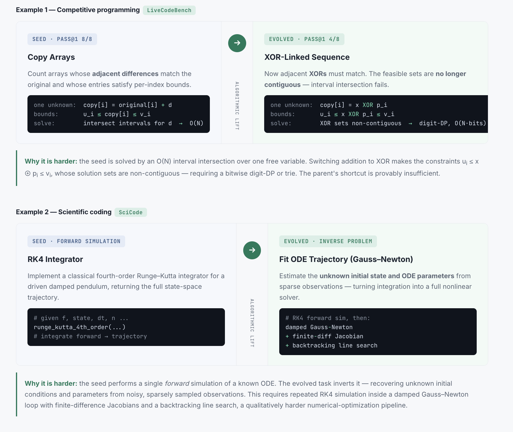
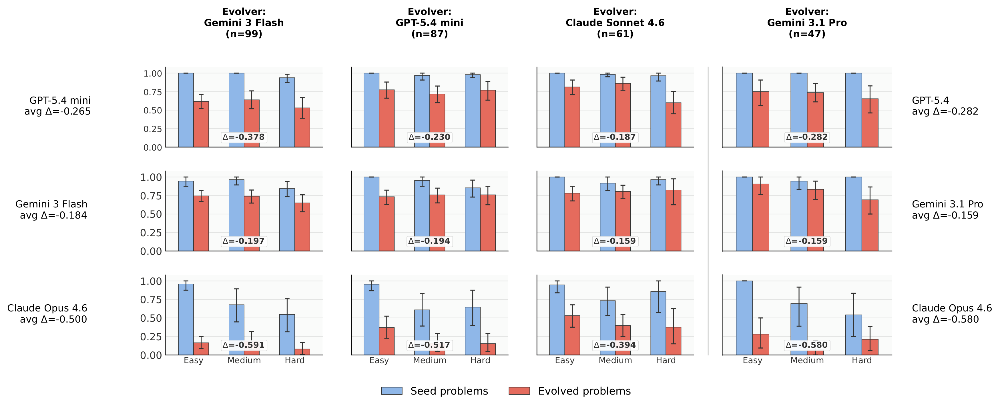
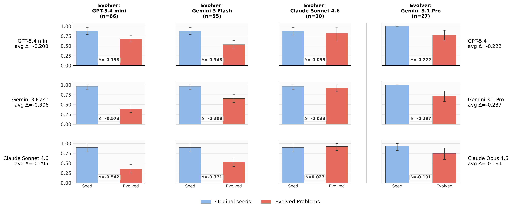
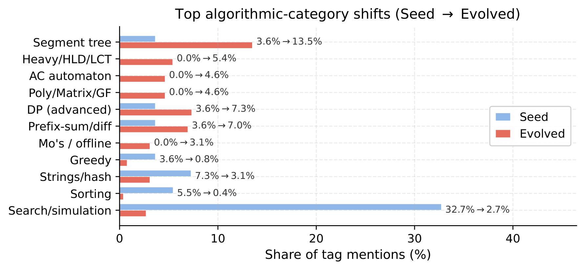
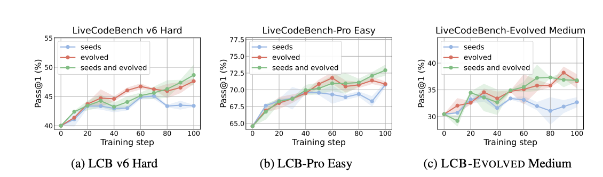

# BenchEvolver: Frontier Task Synthesis via Solution-Centric Evolution

<div class="author-info">
<strong>
    <a href="https://thu-wyz.github.io/">Yangzhen Wu*</a>,
    <a href="https://aaron-jx-li.github.io/">Aaron J. Li*</a>,
    Wenjie Ma, Li Cao, Ziheng Zhou, Mert Cemri, Shu Liu,
    Yuran Xiu, Chenxiao Yan, Haikun Zhao, Bin Yu,
    Ion Stoica&dagger;, Dawn Song&dagger;
</strong>
<br>
University of California, Berkeley &nbsp;·&nbsp; Institute for Interdisciplinary Information Sciences, Tsinghua University
<br>
(* equal contribution, &dagger; equal advising)
<br>
June 13, 2026
<br>
<em>(Est. 5 minutes read &mdash; more details on the
<a href="https://benchevolver.github.io/" target="_blank">project page</a>,
<a href="https://arxiv.org/abs/2606.01286" target="_blank">paper</a>,
<a href="https://github.com/thu-wyz/BenchEvolver" target="_blank">code</a>, and
<a href="https://huggingface.co/BenchEvolver" target="_blank">dataset</a>)</em>
</div>


*Static benchmarks are dying — they get saturated quickly by frontier models* For example, on LiveCodeBench, today's frontier models already score over **99%** on the newest (v6) easy problems and above **90%** across all splits. Once a benchmark saturates, it can no longer separate strong models or provide meaningful guiding signals for further model improvement. But manually curating harder tasks is slow, expensive, and always one step behind the models. Evaluation should instead **co-evolve with the models it measures.**

## TL;DR

**BenchEvolver** automatically turns problems that models have already mastered into substantially harder, fully verified ones. The key shift is direction: instead of writing a new problem and hoping it is hard, BenchEvolver **evolves a reference solution first**, then builds the problem statement and tests.

BenchEvolver does not just define difficulty based on heuristics. It changes the underlying solution, then keeps the tasks that real target models actually struggle with — including, in our experiments, the model that created them. That means no stronger teacher is needed. This unlocks two things:

* **Upgraded benchmarks.** We curate **LiveCodeBench-Plus**, a 91-problem benchmark combining evolved tasks with difficult original LCB-v6 problems. Frontier-model Pass@1 ranges from **27.5% to 62.6%**, restoring clear separation among strong coding models.

* **Self-improvement.** Evolved tasks are not just harder benchmark items; they become training signal. Using **gpt-oss-20b** as both evolver and target, RL on evolved tasks improves held-out coding performance beyond training on the original seeds alone, with **70.7% more gain on LiveCodeBench v6 Hard** and **34.8% more gain on LiveCodeBench-Pro Easy**.

The loop closes: **models generate hard tasks → learn from them → get stronger.**


## One mutation, a substantially upgraded problem

The fastest way to see how BenchEvolver works is to watch it turn an easy problem into a hard one. Instead of writing a new problem and hoping it's difficult, it starts from a **known-correct solution**, mutates it into something structurally different, and only then writes the problem and tests to match:

> **working solution → evolved solution → new problem + tests**

Change the computation, and a familiar-looking problem can suddenly demand an entirely new algorithm. The same move works across two very different coding domains:



**Competitive programming.** A counting problem solved by a simple linear scan becomes much harder with one tweak — swapping a "+" for an **XOR**. That small change shatters the clean structure the easy solution relied on, and the model now needs a fundamentally different algorithm. The pass rate drops from 8/8 to 4/8.

**Scientific computing.** A textbook simulation that runs a physical system *forward* is inverted into the much harder question of working *backward* — recovering the hidden parameters that would produce a handful of noisy observations. Same setting, a qualitatively tougher problem.

The surface story stays familiar; the computation underneath jumps to a different world. And the difficulty is *real* — it's baked into a solution that genuinely requires it, not bolted on as surface complexity.

## How it works: evolutionary generation with memory

The example above shows the core idea, but a practical benchmark generator has to do more: reject invalid tasks, filter out superficial difficulty, and keep the search diverse. BenchEvolver handles this with an evolutionary loop with memory, so each round builds on previous successes and failures rather than sampling independently:


- **Proposer** mutates a solution into a harder one and writes a complete, runnable task around it.
- **Evaluator** throws out *fake* difficulty — checking that everything is consistent and that real models actually struggle.
- **Memory** remembers what worked, what failed, and which kinds of problems have already been tried, steering the search toward fresh, genuinely hard directions.

Three principles keep the output honest:

- **Generate in solution space.** Change the computation first, so difficulty is built into the task rather than painted onto its surface.
- **Verify by agreement.** Several independent checks — not a single AI judge — must agree the problem, solution, and tests all describe the same task.
- **Select by real failure.** Difficulty is *measured*, not assigned: a task survives only if models genuinely fail it more often than its original.

The result is a scalable pipeline for producing verified, diverse, and empirically difficult problems — without requiring humans to write each task or a stronger model to serve as teacher.

## The problems are genuinely harder

Across both domains and every model we tried, evolved problems consistently cut pass rates relative to their originals. The most telling part: **each model also struggles on the problems it evolved itself** — the signature of *self-challenging* generation. The model is probing regions near its own capability boundary, instead of depending on a stronger-teacher distillation setup.





The difficulty is not merely superficial. Six competitive-programming experts (Codeforces master / IOI / ICPC level) manually reviewed the evolved problems: they rated them more novel and much harder — yet just as *clear* as the originals. This suggests the difficulty reflects algorithmic changes rather than obfuscation. It also broadens *what* gets tested. The originals lean on a few familiar patterns; the evolved problems spread across a wider range of advanced algorithms and data structures, growing the number of distinct algorithmic categories from **19 to 30**. BenchEvolver therefore increases difficulty while also expanding algorithmic coverage.



## LiveCodeBench-Plus: a benchmark that discriminates again

We took the best evolved problems — each vetted by experts — and combined them with the hardest surviving originals into **LiveCodeBench-Plus**, a 91-problem benchmark for frontier coding models. On the hardest split, average pass rates fall from **87% to 46%**, and the strongest models now spread cleanly from **27.5% to 62.6%**. The resulting benchmark restores clear separation among state-of-the-art models.

| Model | Provider | Pass@1 |
|---|---|---|
| GPT-5.5 | OpenAI | 62.6 |
| Gemini-3.1-Pro | Google | 59.1 |
| GPT-5.4 | OpenAI | 54.1 |
| Gemini-3.5-Flash | Google | 50.0 |
| Qwen-3.7-Max | Alibaba | 47.5 |
| Gemini-3-Flash | Google | 40.1 |
| GPT-5.4-mini | OpenAI | 29.6 |
| DeepSeek-V4-Pro | DeepSeek | 27.5 |

## Self-improvement: evolved tasks as training signal

The same evolved tasks can also be used as training signal. If a model can generate problems that are genuinely hard *for itself*, those problems should be exactly what it needs to *learn* from. So we closed the loop: take a model, have it evolve problems it already solves into harder versions, then train it on those self-made challenges.



It works. Training on evolved problems improves held-out coding performance well beyond training on the original problems alone. On LiveCodeBench v6 Hard, adding evolved tasks gives up to +8.7 Pass@1 points, a 70.7% larger gain than seed-only training. On LiveCodeBench-Pro Easy, it gives 34.8% more gain than seed-only training.

The improvement also transfers to a separate evolved benchmark built by a different model, where evolved-task training gains +7.77 points and beats seed-only training by +4.56 points. So this is not just memorizing look-alike tasks. The model finds its own weaknesses, turns them into verified training signal, and learns from them.

## Why it matters, and what's next

Any fixed benchmark eventually saturates — and the better our models get, the faster it happens. BenchEvolver points to a different way of thinking about evaluation: not a static dataset that goes stale, but a **living benchmark** — a pipeline that keeps generating, verifying, and calibrating fresh challenges against whatever the frontier looks like today.

And because those same verified challenges can also *train* the models that fail them, evaluation and training stop being separate stages. They fuse into one loop: the problems that expose a model's limits become the problems that help it move past them.

The same idea is not limited to the above single-shot coding benchmarks. We are continuing to explore how solution-centric evolution can extend to more agentic coding tasks, where success may depend on multi-step interaction with repositories, tools, and environments, as well as to broader domains where verification is less straightforward than running hidden tests. The overarching goal remains the same: to generate self-challenging and meaningful tasks in a scalable way.

For the full method details, validation protocols, and experiments, see the [paper](https://arxiv.org/abs/2606.01286), [code](https://github.com/thu-wyz/BenchEvolver), and [dataset](https://huggingface.co/BenchEvolver).

#### Citation

```bibtex
@misc{wu2026benchevolverfrontiertasksynthesis,
      title={BenchEvolver: Frontier Task Synthesis via Solution-Centric Evolution},
      author={Yangzhen Wu and Aaron J. Li and Wenjie Ma and Li Cao and Ziheng Zhou and Mert Cemri and Shu Liu and Yuran Xiu and Chenxiao Yan and Haikun Zhao and Bin Yu and Ion Stoica and Dawn Song},
      year={2026},
      eprint={2606.01286},
      archivePrefix={arXiv},
      primaryClass={cs.SE},
      url={https://arxiv.org/abs/2606.01286},
}
```
